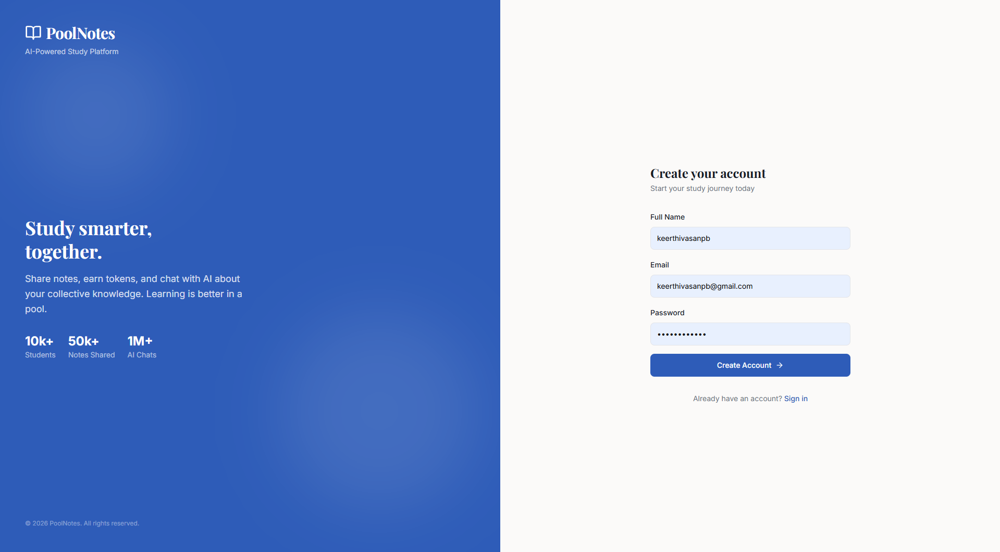
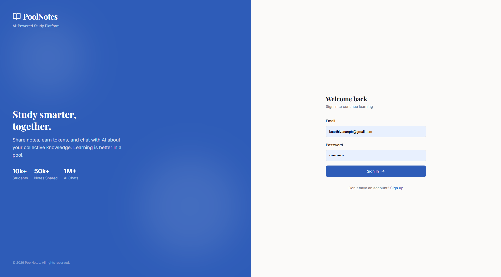
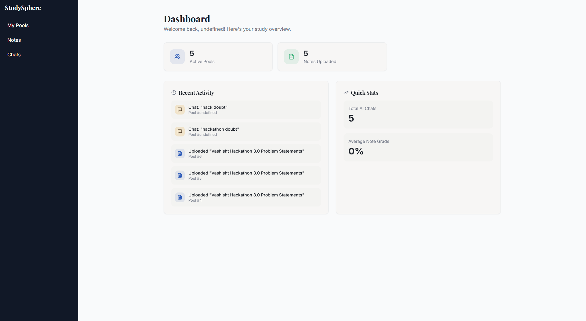
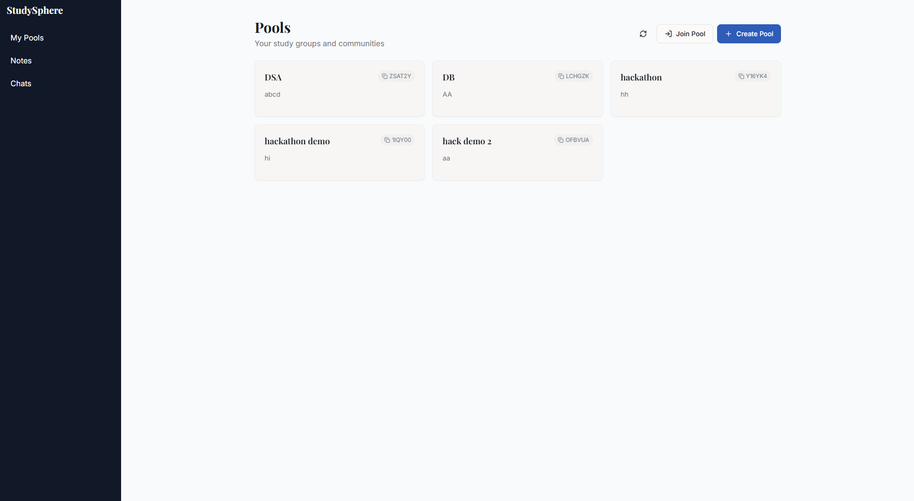
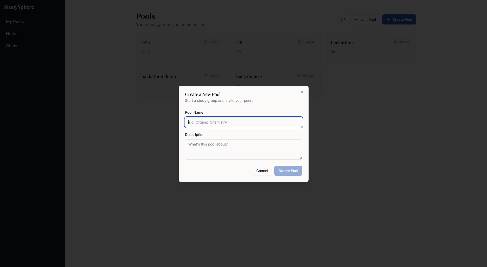
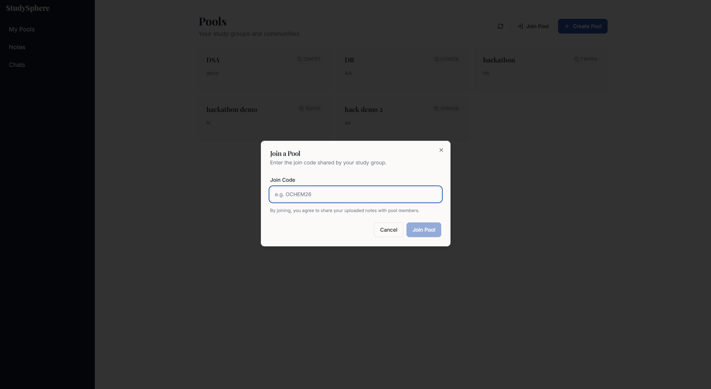
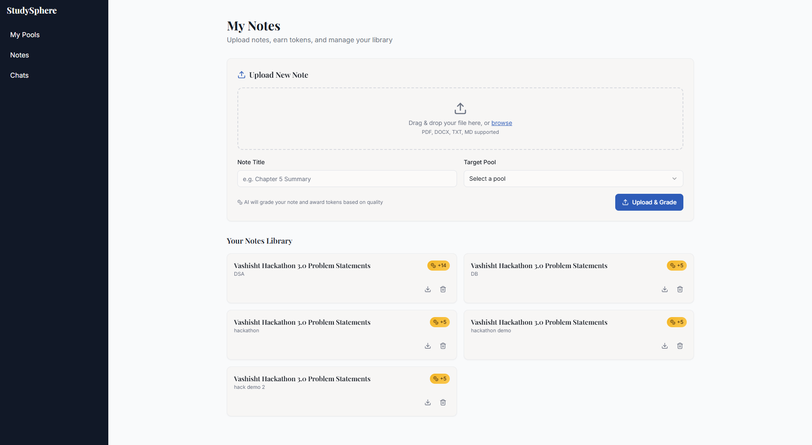
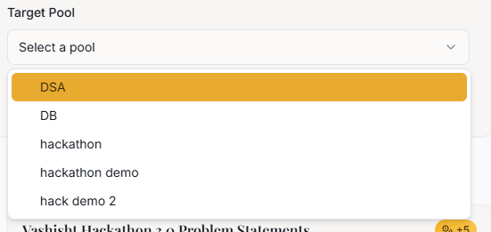
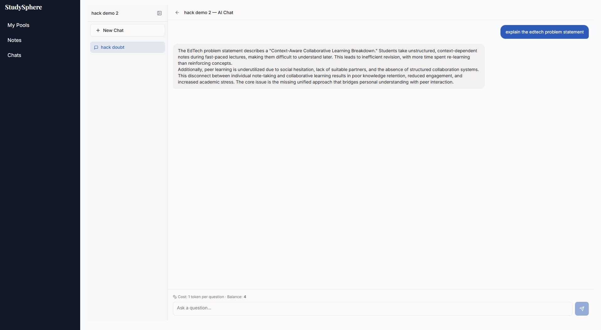
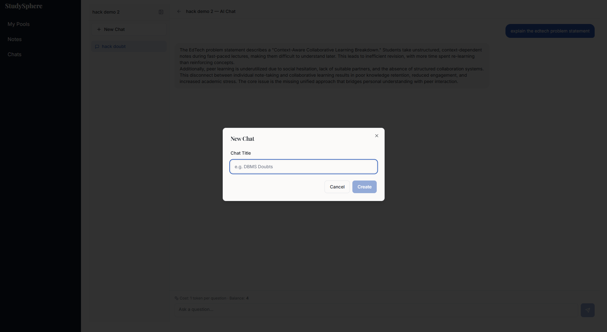

# StudySphere — Collaborative Notes Sharing with Token Economy

## Live Demo
🔗 Deployed Link: https://vashist-5j8tek0do-sanjay-azhagans-projects.vercel.app?_vercel_share=P2sezmBuHw6kwYUuQ0s6N4vmf9RBdgOc

---

## Demo Video
🎬 Watch here: https://drive.google.com/file/d/14KjZ_LxsBA_a9Jx7uRLZA6Wba89Mymff/view?usp=sharing

---

## Core Idea  

### Problem Statement & Pain Points
Traditional learning environments suffer from a disconnect between individual effort and collective knowledge. Our solution addresses the following specific pain points identified in the Vashisht Hackathon 3.0 EdTech track:
- Unstructured & Context-Dependent Notes: Students often take fast-paced, messy notes that lose meaning over time.
- Inefficient Revision: Learners waste time re-learning concepts instead of reinforcing them.
- The "Freeloader" Problem: Peer learning is often underutilized because there is no structured system to reward contributors or engage hesitant students.
- Lack of Collaboration: There is currently no unified bridge between personal notes and peer interaction.

### Our Solution
StudySphere is a decentralized, pool-based notes sharing and RAG (Retrieval-Augmented Generation) platform that turns passive note-taking into an active, rewarded ecosystem.
- Isolated Context PoolsInstead of a generic AI, we use Pool-Specific RAG contexts. Each subject or lecture series has its own "Pool." This ensures that when a student asks a question, the AI only draws answers from the specific notes uploaded to that pool, eliminating irrelevant "hallucinations" and maintaining high context accuracy.
- Token-Based Economy (Anti-Freeloader)To solve the lack of structured collaboration, we implemented a Token System:
    - Earn: Students earn tokens by uploading high-quality notes.
    - Spend: Tokens are consumed when asking the AI questions or accessing RAG-based summaries.
    - Incentive: This creates a self-sustaining cycle where the best "teachers" (contributors) get the most "tutoring" (AI assistance).
- AI-Powered Auto-GradingTo prevent the system from being flooded with "junk" notes, every upload is passed through an AI Grading Pipeline. Tokens are awarded based on the quality, depth, and clarity of the contribution, ensuring the RAG context remains high-quality

---


---

## Tech Stack
- **Frontend:**Reactjs
- **Backend:** Node.js, Express.js 
- **Database:** PostgreSQL  
- **Auth:** JWT (Access + Refresh Tokens)  
- **File Handling:** Multer (memory storage)  
- **AI Integration:** RAG-based system  

---

## System Architecture

🔗 Excalidraw ER Diagram: https://excalidraw.com/#room=9775246f05290af03caa,csK_0FDNfITTyfIOXGS2qw

---

##Full Flow Explanation

### 1. Authentication
- User signs up → email verification  
- Login → access + refresh tokens  

---

### 2. Pools
- User creates a pool → gets a **join code**  
- Others join using the code  

---

### 3. Notes Contribution
- User uploads PDF  
- AI extracts text
- AI grades user's notes  
- Tokens are awarded
- Notes are stored in both Pinecone and Postgresql  

---

### 4. Token System
- Tokens stored internally as **integer units** 
- Asking a question costs **1 token**  
- Tokens will be awarded based on the grade given by AI

---

### 5. AI Chat (RAG)
- User creates chat inside pool  
- Asks questions based on pooled notes  
- High context accurate answers
- Tokens deducted per query 

---

### 6. Continuous Contribution Loop
```text
Upload Notes → Earn Tokens → Ask Questions → Spend Tokens → Repeat
```
## Screenshots
### Authentication



### User Dashboard


### Pools




### Notes Upload



### Chat Interface



---

## API Endpoints
### Auth
POST /api/auth/signup
POST /api/auth/login
GET /api/auth/verify
POST /api/auth/refresh
POST /api/auth/logout
### Pools
POST /api/pools
POST /api/pools/join
GET /api/pools
### Notes
POST /api/notes
GET /api/notes/:poolId
GET /api/notes/:noteId
PUT /api/notes/:noteId
DELETE /api/notes/:noteId
### Chat
POST /api/chats
GET /api/chats/:poolId
### Q&A
POST /api/chats/:chatId/ask
GET /api/chats/:chatId/history
### Dashboard
GET /api/dashboard
GET /api/pools/:poolId/details

---

## How to Run Locally

```bash
git clone <repo>
cd server
npm install
```
---

## Setup Environment Variables

### Create a .env file in the server folder and add:
```env
OPENAI_API_KEY=sk-your-api-key-here
PORT=ur_port


DATABASE_URL=njknjkfd

JWT_SECRET=supersecretkey

CLOUDINARY_CLOUD_NAME=your_name
CLOUDINARY_API_KEY=your_key
CLOUDINARY_API_SECRET=your_secret

EMAIL_USER=app_gmail_id
EMAIL_PASS=gmail_app_password
BASE_URL=ur_base_url_for_resetlink

JWT_SECRET=jwt_secret
JWT_REFRESH_SECRET=refresh_secret

JWT_EXPIRES_IN=time_like_1d
JWT_REFRESH_EXPIRES_IN=time_like_5d

PINECONE_API_KEY=njdcmsocpjfckldmkvfdjmkl
PINECONE_INDEX="vashist"
PINECONE_HOST=hosturl
GEMINI_API_KEY=ckdlsmklcmklcdsmlmlkcdsm
```
---

## Run the Server
```bash
npm run dev
```
- Seed Data
```bash
npm run seed
```
---

## Technical Implementation Details
- The RAG Pipeline (Powered by Gemini & Pinecone): To solve the "Context-Aware" requirement of the problem statement, we implemented a multi-tenant RAG architecture:
    - Vector Database (Pinecone): We utilize Pinecone's Namespaces to isolate data by poolId. This ensures that when a user asks a question in a "Data Structures" pool, the search is strictly confined to that pool's specific vector space, preventing cross-context interference.
    - LLM (Gemini 1.5 Flash/Pro): We leverage Gemini for its high-context window and native multimodal capabilities. It handles:Note Synthesis: Transforming raw uploaded text or images into structured embeddings.
    - Contextual Q&A: Answering user queries based strictly on the retrieved chunks from Pinecone.
- AI-Driven Token Economy & Quality Control: To address "Reduced Engagement" and the "Freeloader Problem", we automated the incentive structure:
    - Auto-Grading (/api/notes): Upon upload, Gemini analyzes the notes for technical accuracy, completeness, and clarity.
    - Dynamic Rewards: The system issues tokens to the TOKEN table based on the AI's numerical grade. High-quality contributions yield more tokens, while low-effort or irrelevant uploads are rejected to keep the pool "clean".
    - Consumption: Tokens are deducted via /api/chats/:chatId/ask. This ensures that users must contribute value to the community to receive AI-assisted learning insights.
- Data Flow & Security
    - Authentication: JWT-based security (/api/auth) ensures that token balances and private notes remain secure.
    - Storage: While Pinecone stores the vector embeddings for RAG, PostgreSQL manages the relational metadata between Users, Pools, Poolmember, Notes, Token, Chats and QA.

---

## Evaluation Alignment

- Innovation (20%): Unique token-economy for peer learning.

- Technical Implementation (35%): Robust RAG isolation and auto-grading logic.

- Feasibility (20%): Scalable pool-based architecture for real-world classrooms.

- Video Presentation (15%) : https://drive.google.com/file/d/14KjZ_LxsBA_a9Jx7uRLZA6Wba89Mymff/view?usp=sharing

- Deployment (10%): Hosted at: https://vashist-5j8tek0do-sanjay-azhagans-projects.vercel.app?_vercel_share=P2sezmBuHw6kwYUuQ0s6N4vmf9RBdgOc

---